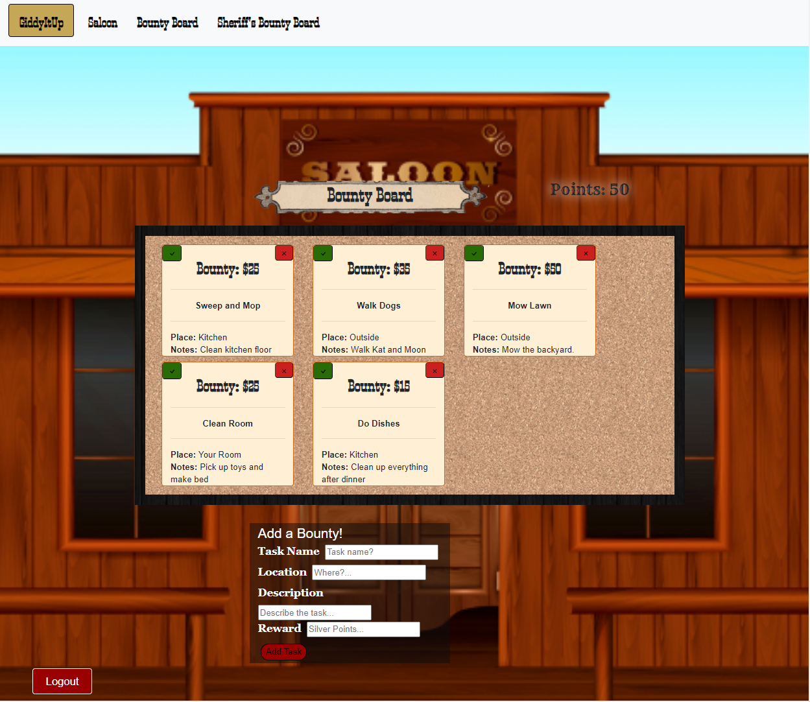

## Title

GiddyItUp

## Description

Howdy, Partner!!
There's a new sheriff in town, and new deputies too! Gather your deputies now to start turning in bounties for rewards!

This is an app for parents with young children and uses a game-like system with a Wild West theme to encourage their children to go above and beyond with their household chores by offering a 'bounty reward' system in which they receive points for completing 'bounties' (tasks). The children can use these points as a currency for extra privileges at home, such as extra screen-time, an extended bedtime, a treat at the candy store, or anything else the parent can think of!

Once a parent has been signed-in, they can add children to their account and choose avatars for each child. The parent can also create as many tasks as they would like on the 'Sheriff's Bounty Board' and the child can view the given tasks on the 'Deputy's Bounty Board'. When a child has completed a task, the parent can go into their bounty board page and approve the task by clicking the check mark and, on page reload, the top of the page will display and reflect the current number of points received by the child. They also have the option to delete tasks that were not completed.

## Table of Contents :

[Title](#Title),
[Description](#Description),
[Usage](#Usage),
[License](#License),
[Contributors](#Contributors),
[Link](#Link),
[Questions](#Questions),
[Suggestions](#Suggestions),
[COPPA](#C.O.P.P.A.)

## Usage

This project can be used by anyone for educational or personal use only.

## License

This project is licensed under the MIT license.

## Contributors

- Jimmy Alonso
- Evelyn Goris
- Kesha Hall
- Lauren Noeltner

## Link

[Link](https://giddyitup.herokuapp.com/)

## Questions

You can ask questions on GitHub at:

- Jimmy Alonso: https://github.com/jvalon9455
- Evelyn Goris: https://github.com/SIROG-E
- Kesha Hall: https://github.com/hallkr86
- Lauren Noeltner: https://www.github.com/LNoeltner1

## Suggestions

If you have any suggestions for improvements to this app, feel free to contact any of the contributors at their GitHub profiles listed above.

## C.O.P.P.A.

Disclaimer:

We collect both parent and children information into our database, but we do not make this information public, nor do we share any of the information with any entity, private or public. We also do not use this data for any purpose other than to make sure your information is accessible upon sign-in.
